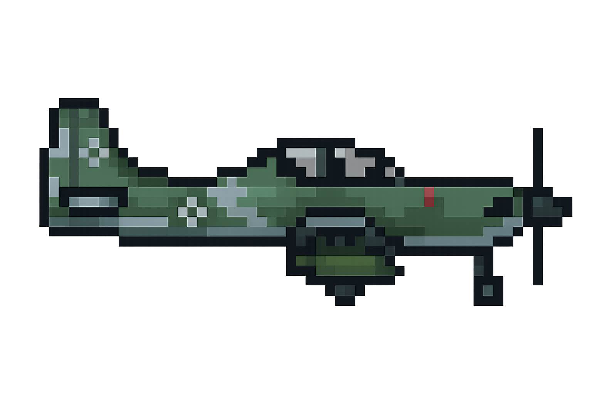

# V.A.D.E.R. 🦅
**Visualizador Analítico de Dados de Engenharia e Rastreio**

Aplicação web local em Python/Streamlit para ingestão, processamento e visualização interativa de telemetria de voo extraída de equipamentos VADR (Flight Data Recorder), com foco na aeronave **A-29 Super Tucano**.

Correlaciona comandos de voo, atitude espacial, performance do grupo motopropulsor e mensagens de falha (EICAS) em uma linha do tempo unificada, facilitando o *troubleshooting* na linha de manutenção.

---

## Execução Rápida

```bash
# 1. Clone e entre na pasta
git clone <url-do-repositorio>
cd vader

# 2. Crie e ative o ambiente virtual
python -m venv venv
venv\Scripts\activate        # Windows
# source venv/bin/activate   # Linux/Mac

# 3. Instale as dependências
pip install -r requirements.txt

# 4. Inicie a aplicação
streamlit run app.py
```

Acesse `http://localhost:8501` no navegador. Carregue um arquivo `.csv` exportado pelo VADR na barra lateral.

---

## Funcionalidades

| Módulo | Descrição |
|--------|-----------|
| **Ingestão CSV → Parquet** | Detecta e pula os 7 cabeçalhos de metadados do VADR; converte para Parquet (Snappy) em `data/processed/`; reprocessa apenas se o CSV tiver sido modificado |
| **Linha do Tempo** | Gráfico interativo (zoom/pan) de qualquer variável numérica; bandas coloridas de voo (azul) e solo (marrom); marcadores de falha MW* sobre a curva |
| **Horizonte Artificial** | Instrumento de atitude com pitch, roll, escada de referência e ponteiro dinâmico de bank |
| **Gauges do Motor (EICAS)** | 7 instrumentos: Torque, ITT, Np, Ng, Fuel Flow, Oil Temp, Oil Press — com zonas de cor e needle dinâmico |
| **Janela CAS** | Lê `MWC_DATA` e flags `MW1_*/MW2_*/MW3_*`; exibe WARNINGS (vermelho) acima de CAUTIONS (amarelo); "VOO NORMAL" quando limpo |
| **Cards de Subsistemas** | Trem de pouso (lógica invertida LDG), carga estrutural (alerta NZ > 4G), resumo de motor, posição PCL |
| **Time Scrubbing** | Slider temporal sincroniza todos os painéis instantaneamente |

---

## Estrutura do Projeto

```
vader/
├── app.py                  # Ponto de entrada — layout e orquestração Streamlit
├── requirements.txt        # Dependências Python
├── .gitignore
│
├── src/
│   ├── data_loader.py      # Ingestão CSV → Parquet, DataLoader
│   ├── plots.py            # TimelinePlotter, AttitudeIndicator, EngineGaugePlotter
│   └── ui_components.py    # EICASPanel, SubsystemCards, AttitudeBox, TimeController
│
├── data/                   # Ignorado pelo Git
│   ├── raw/                # CSVs originais do VADR
│   └── processed/          # Cache .parquet gerado automaticamente
│
├── assets/                 # Imagens estáticas (perfis da aeronave)
│
└── docs/                   # Documentação técnica
    ├── ROADMAP.md
    ├── SCS.md
    ├── Dicionario_de_Dados_VADER.md
    ├── Guia_UI_EICAS.md
    └── CONTRIBUTING.md
```

---

## Tecnologias

| Biblioteca | Uso |
|------------|-----|
| `streamlit >= 1.32` | Interface web e widgets |
| `pandas >= 2.0` | Manipulação de dados, forward-fill |
| `plotly >= 5.20` | Gráficos interativos e gauges |
| `pyarrow >= 15.0` | Cache Parquet com compressão Snappy |

---

## Documentação Técnica

| Documento | Conteúdo |
|-----------|----------|
| `docs/SCS.md` | Especificação completa de requisitos (RF, UI, RNF) |
| `docs/Dicionario_de_Dados_VADER.md` | Mapeamento de variáveis CSV, ranges e lógica de tratamento por fase |
| `docs/Guia_UI_EICAS.md` | Diretrizes de UX, cores, thresholds e comportamento do painel EICAS |
| `docs/CONTRIBUTING.md` | Padrões de contribuição e workflow de desenvolvimento |
| `docs/ROADMAP.md` | Histórico de fases e entregas |

---


*A-29 Super Tucano — aeronave de referência do projeto.*
