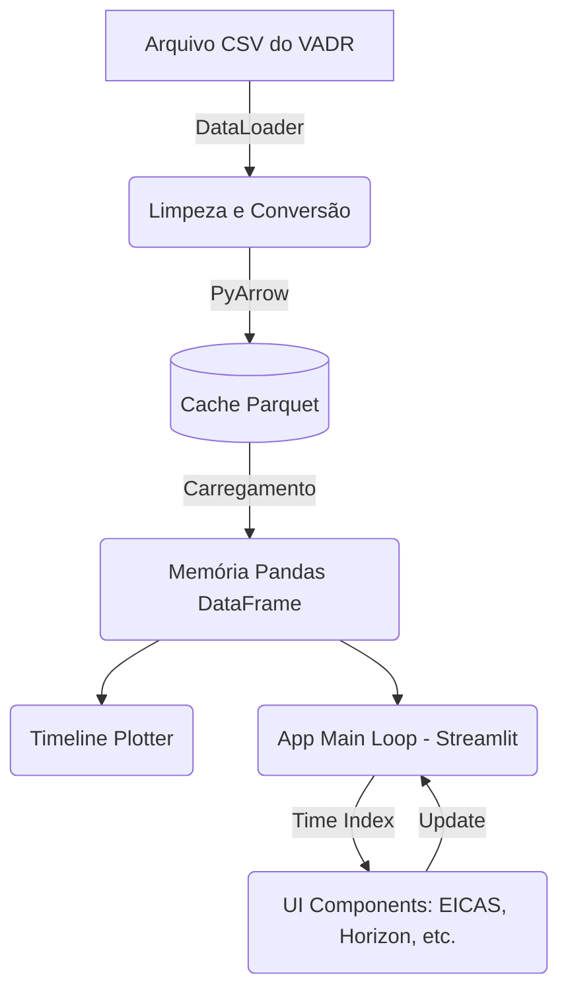

# Arquitetura do Sistema (Architecture)

## 1. Tipo de Sistema
**Aplicação Web Monolítica Local**. Desenhada para rodar estritamente off-line devido ao caráter sigiloso dos dados de voo militar (FDR/VADR).

## 2. Tecnologias Utilizadas
- **Linguagem:** Python 3.x
- **Interface e Roteamento:** Streamlit (v1.x)
- **Manipulação de Dados:** Pandas / PyArrow (Serialização Parquet)
- **Renderização Gráfica:** Plotly Graph Objects (renderização standalone em web GL e vetorial)

## 3. Estrutura Geral e Fluxo de Informação

## 4. Camadas (Separation of Concerns)
A aplicação está estritamente delimitada:

* **src/data:** 
  O Data Loader encapsula a lógica de ignorar cabeçalhos inválidos do equipamento extrator, fazer conversão otimizada de tipos (`int`, `float`), preencher lacunas (forward-fill / ffill) para frequências mais lentas. *Essa camada nunca toca em componentes de exibição*.

* **src/ui:** 
  Subdivida em motores geométricos (Plotly / Plot) e motores de componente (Streamlit). O arquivo `plots.py` cuida da pesada geometria vetorial para construir os instrumentos (Gauges, Horizon), enquanto `components` isola a marcação visual de tela do Streamlit.
