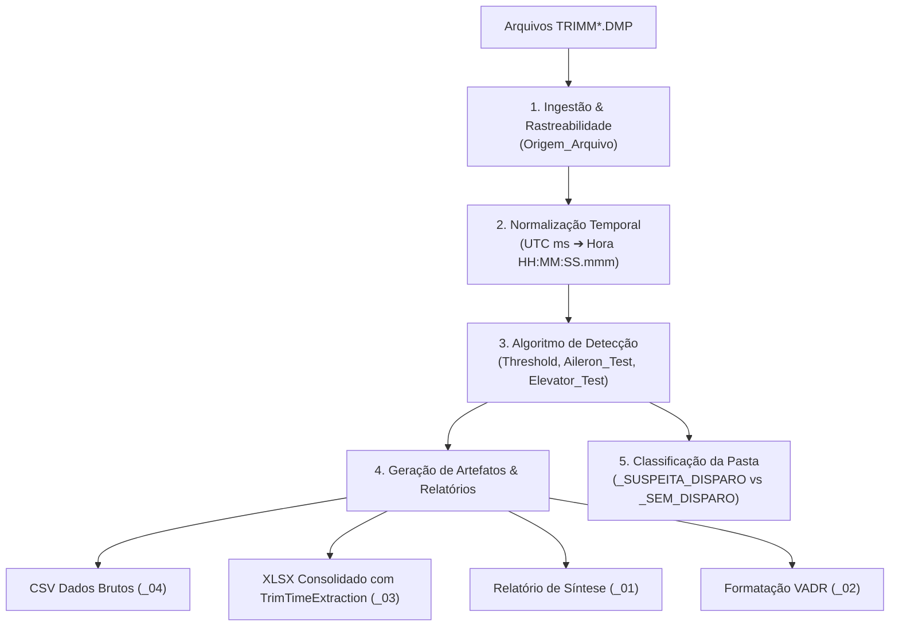

# Papel e Funcionamento do Conversor de Arquivos DMP (TRIMM)

> **Arquivo de Referência:** [`archive/dtc-mode/conversor.py`](file:///Users/bruno/Documents/Gemini/10_PROJETOS/VADER/archive/dtc-mode/conversor.py)  
> **Módulos Integrados no V.A.D.E.R.:** [`src/data/dtc_parser.py`](file:///Users/bruno/Documents/Gemini/10_PROJETOS/VADER/src/data/dtc_parser.py) e [`src/ui/views/dtc.py`](file:///Users/bruno/Documents/Gemini/10_PROJETOS/VADER/src/ui/views/dtc.py)

---

## 1. Visão Geral e Propósito

O script `conversor.py` foi concebido para realizar a ingestão, consolidação e análise automatizada de arquivos brutos de despejo de telemetria do **DTC (Data Transfer Cartridge)**, denominados `TRIMM*.DMP`.

Seu objetivo central é identificar **atuações não comandadas e disparos nos sistemas de compensação (*trim*) de Aileron e Profundor (Elevator)**, substituindo e modernizando a antiga rotina manual baseada nas macros VBA do Excel (`PitchTrimSwitchMonitor` e `TrimTimeExtraction`).

---

## 2. Estrutura dos Arquivos de Entrada (DMP)

Os arquivos `TRIMM*.DMP` são saídas brutas separadas por ponto e vírgula (`;`), sem linha de cabeçalho, com 18 variáveis relevantes de voo seguidas por um delimitador final:

| Coluna | Parâmetro | Descrição |
| :--- | :--- | :--- |
| 1 | `UTC` | Carimbo de tempo do dia expresso em **milissegundos** |
| 2 | `Emer_ON` | Status da chave de emergência ON |
| 3 | `Emer_SW` | Status da chave seletora de emergência |
| 4 | `Stick_FWD` | Comando de manche para frente (*Pitch Down*) |
| 5 | `Stick_AFT` | Comando de manche para trás (*Pitch Up*) |
| 6–10 | `CAS`, `TAS`, `GS`, `BARO`, `RALT` | Velocidades (Calibrada, Verdadeira, Solo) e Altitudes (Barométrica, Radar) |
| 11–12 | `PITCH_ANG`, `ROLL_ANG` | Atitude da aeronave (Ângulo de Arfagem e Rolamento) |
| 13 | `AIL_T_POS` | Posição física do Compensador de Aileron |
| 14 | `ELEV_T_POS` | Posição física do Compensador de Profundor (*Elevator Trim*) |
| 15 | `RUD_T_POS` | Posição física do Compensador de Leme (*Rudder Trim*) |
| 16–18 | `PITCH_MIS`, `ROLL_MIS`, `Yellow_Zone` | Parâmetros de missão e zonas de alerta |

---

## 3. Etapas do Processamento e Regras de Negócio

### 3.1. Ingestão e Rastreabilidade
- Varre subdiretórios localizando todos os arquivos `TRIMM*.DMP`.
- Mapeia o esquema de colunas correto e descarta o delimitador vazio final.
- Insere a coluna `Origem_Arquivo` na primeira posição para manter a linhagem e rastreabilidade dos dados após a concatenação.

### 3.2. Normalização Temporal
- O tempo original em milissegundos (`UTC`) é convertido para texto formatado `Hora` (`HH:MM:SS.mmm`).

### 3.3. Algoritmo de Detecção de Disparo / Salto de Compensador
O algoritmo verifica se houve salto de posição das superfícies acima do esperado durante descontinuidades temporais:

1. **Cálculo do Limiar de Tempo (*Threshold*):**
   $$\text{Threshold\_ms} = (UTC_{1} - UTC_{0}) \times 2$$
   *(Calculado a partir do intervalo inicial entre amostras consecutivas).*

2. **Condição Temporal:**
   $$\Delta UTC = UTC_{t+1} - UTC_{t} > \text{Threshold\_ms}$$

3. **Detecção no Aileron (`Aileron_Test`):**
   $$\text{Aileron\_Test} = 1 \iff \Delta UTC > \text{Threshold\_ms} \quad \text{E} \quad |\text{AIL\_T\_POS}_{t} - \text{AIL\_T\_POS}_{t+1}| > 1.0$$

4. **Detecção no Profundor (`Elevator_Test`):**
   $$\text{Elevator\_Test} = 1 \iff \Delta UTC > \text{Threshold\_ms} \quad \text{E} \quad |\text{ELEV\_T\_POS}_{t} - \text{ELEV\_T\_POS}_{t+1}| > 1.0$$

Se a contagem total de `Aileron_Test` ou `Elevator_Test` for maior que zero, o voo é marcado com **Suspeita de Disparo**.

---

## 4. Artefatos Gerados

Para cada subpasta analisada, o script produz arquivos padronizados:

1. **`{PREFIXO}_04_TRIMM_Dados_Brutos.csv`**:
   - Dados consolidados completos exportados em CSV com separador `;`.

2. **`{PREFIXO}_03_TRIMM_Consolidado.xlsx`**:
   - Planilha Excel com formatação condicional destacando erros em vermelho (`1`) e comandos de manche/chaves ativadas (`"T"`).
   - **Cabeçalho Extrator (`TrimTimeExtraction`)**: Bloco inserido no topo (linhas 1–5) mapeando o threshold, totalizadores e as coordenadas exatas (Linha, Tempo e Posição) antes e após cada anomalia.

3. **`{PREFIXO}_01_Report_TRIMM.xlsx`**:
   - Relatório executivo de síntese contendo quantitativo de arquivos lidos, flags de atuação, threshold aplicado e campos para preenchimento de missão, aeronave e tripulação.

4. **`{PREFIXO}_02_VADR_Formatado.xlsx`**:
   - Caso existam arquivos `*Mishap Time History Data Set.csv` na pasta, o script os formata ocultando colunas desnecessárias para análise focada de parâmetros de voo.

---

## 5. Classificação Automática de Diretórios

Ao término da análise da pasta:
- Se houver detecção (`Aileron_Test > 0` ou `Elevator_Test > 0`): A pasta é renomeada para `{Nome}_SUSPEITA_DISPARO`.
- Se não houver anomalias: A pasta é renomeada para `{Nome}_SEM_DISPARO`.

---

## 6. Papel no Ecossistema V.A.D.E.R.

O script `archive/dtc-mode/conversor.py` funcionou como a **especificação algorítmica e protótipo funcional** do módulo DTC. 

No aplicativo interativo web V.A.D.E.R., essa lógica foi modularizada em:
- [`src/data/dtc_parser.py`](file:///Users/bruno/Documents/Gemini/10_PROJETOS/VADER/src/data/dtc_parser.py): Responsável pela ingestão de arquivos em lote e em memória (`DtcParser.ingest_files` e `DtcParser.processar_diretorio`).
- [`src/ui/views/dtc.py`](file:///Users/bruno/Documents/Gemini/10_PROJETOS/VADER/src/ui/views/dtc.py): Interface gráfica dedicada à visualização das flags de disparo, métricas de threshold e inspeção tabular com destaque de falhas.
- [`src/ui/views/completa.py`](file:///Users/bruno/Documents/Gemini/10_PROJETOS/VADER/src/ui/views/completa.py): Modo *All-in-One* integrando os alertas DTC com dados de EICAS, HUD e CSVs de voo.
